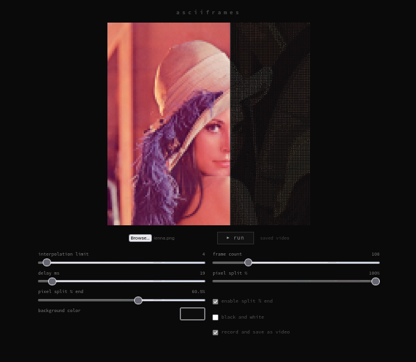

# Asciiframes
Toy Rust+Wasm project to create ascii animations from images.

```bash
rustup target add wasm32-unknown-unknown
cargo install wasm-pack
wasm-pack build --target web
python -m http.server
```




[Example](meta/)
